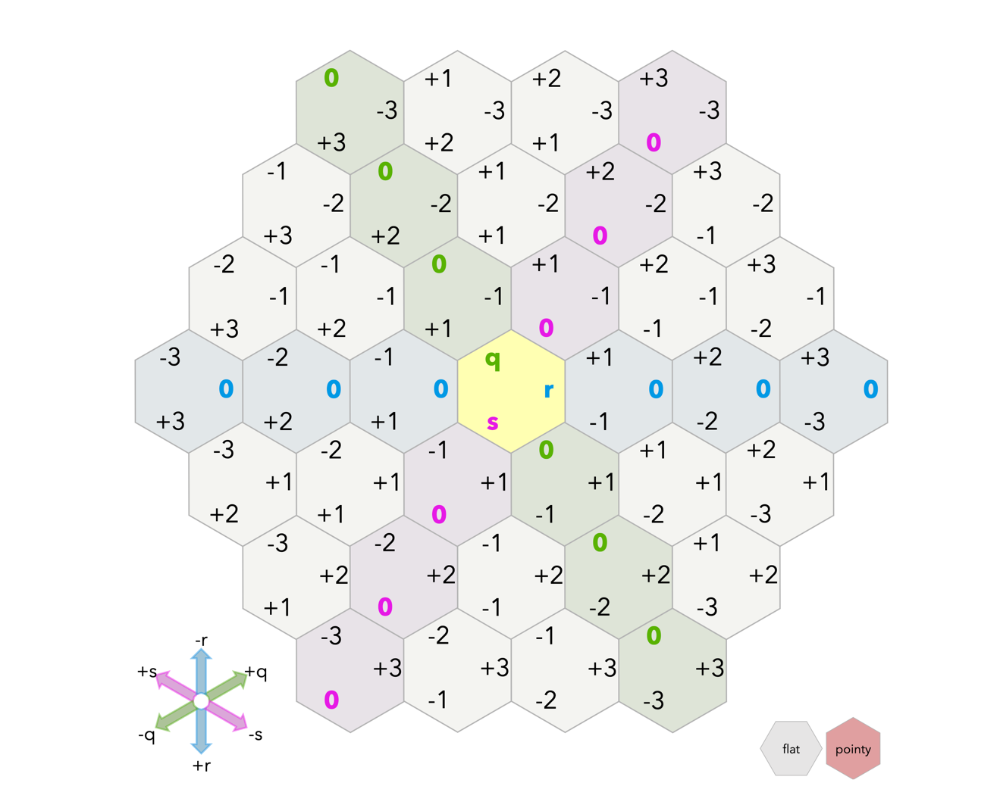

# Hexagonal Reversi Java Implementation

## Overview

This Java codebase is an implementation of the classic Reversi game played on a hexagonal grid. It
follows the MVC (Model-View-Controller) architecture and offers a platform for playing Reversi in a
hexagonal variant. This README serves as a guide for understanding the purpose, structure, and
components of this codebase.

## Quick Start

To get started with this codebase and play a game of Hexagonal Reversi, follow these steps:

```java
import model.HexagonReversi;
import model.IReversiModel;
import view.ReversiTextView;
import view.TextView;

public class Main {
  public static void main(String[] args) {
    IReversiModel model = aHexagonReversi(6); // Specify the number of sides for the game board.
    TextView textView = aReversiTextView(model); // Provide the model for rendering.
    System.out.println(textView.toString()); // Display the game state in the console or your application.
  }
}
```

## Features

- Hexagonal board with
  the [cube coordinates system](https://www.redblobgames.com/grids/hexagons/#coordinates-cube)
- MVC architecture for a structured and modular design
- Player interactions, move validations, and piece capturing
- Customizable game rules and win conditions

## Class Invariant(s)

1. One of the recognized class invariants for the game was the fact that the sideLength of the board
   cannot be less than 3. This is due to the fact that a standard game of hexagon reversi cannot have less than 3 sides since there
   would be no valid move that can be played by either colored token.

2. Another invariant that is enforced in the code pertains to the
   [cube coordinates system](https://www.redblobgames.com/grids/hexagons/#coordinates-cube). An
   IllegalArgumentException is thrown if the sum of the coordinates that are passed into the
   constructor of the HexagonCell is not zero(**i.e. q+r+s != 0**).

3. The player passed into the `placePiece` method cannot be null since the model cannot place a null or empty 
   player into a cell.

## Key Components

### Game Model

The `HexagonReversi` class is the core game model that implements the `IReversiModel` interface, 
responsible for managing game mechanics, including player moves, turn passing, scoring, and game state. It is built on top of the HexagonalBoard class,
representing the game board. 

### Text-based View for Reversi

The `TextView` interface serves as a marker interface for text-based views in the Reversi game. The
`ReversiTextView` class implements this interface and provides a text-based representation of the game
state. It uses the IReversiModel instance to render the game state in text format.

### Game Board Representation

IBoard Interface: Represents the game board and defines methods for cell ownership, move validation,
rendering, score retrieval, and listing valid moves.

### HexagonBoard Class:

An implementation of the IBoard interface, representing the hexagonal game board. It is initialized
with a specified side length. Key methods include newCellOwner, validMove, getCellOccupant,
toString, and validMovesLeft.

### Coordinate System



The [cube coordinates system](https://www.redblobgames.com/grids/hexagons/#coordinates-cube)
from [RedBlobGames](https://www.redblobgames.com/) was used to represent the location of each cell
in the Hexagonal grid for the game. One advantage of using this system
was that it was easy to check if a given cell was within the bounds of the grid and the fact that
the sum of the coordinates of the cell is always 0 made it easy to check if the coordinates are
valid
and within a hexagonal shape or not.

## Key Subcomponents

### Representing Players in the Game

#### IPlayer Interface:

`IPlayer` is a  marker interface for player representation. It includes a method to retrieve the player's color.
An IPlayer can be a human player or an AI(**not implemented yet**).
A concrete class for Human players, called HumanPlayer is made which represents Human Players. The
only field that the `HumanPlayer` class has is a `Color`.

#### HumanPlayer Class:

A concrete implementation of `IPlayer`, representing human players. It allows specifying the player's
color upon instantiation, either `Color.BLACK` or `Color.WHITE`.

#### Color Enum:

The Color enum represents the two players, Black (B) and White (W). It simplifies player management
and provides a next() method for alternating turns.

### Representing Cells in the Board

#### ICell Interface:
An `ICell` represents the location of a cell in the game board grid. This interface was made with the
intention of code extensibility so that the code can be extended to a new format of game board with
a game cell. The ICell interface has only one method, `getCoordinates()` which returns a list of
coordinates of the `ICell`.

#### HexagonCell Class:
The `HexagonCell` class implements the `ICell` interface and it represents the location of a cell in
a `HexagonBoard`. The class is configured to work with a game of `Hexagon Reversi`. The cell's
coordinates are based on the [cube coordinates system](#coordinate-system) mentioned above.
It has an invariant that limits the coordinates such that their sum is 0.


## Source Organization

```
├── README.md
├── src
    ├── model
    │   ├── Color.java
    │   ├── HexagonBoard.java
    │   ├── HexagonCell.java
    │   ├── HexagonReversi.java
    │   ├── HumanPlayer.java
    │   ├── IBoard.java
    │   ├── ICell.java
    │   ├── IPlayer.java
    │   └── IReversiModel.java
    └── view
        ├── ReversiTextView.java
        └── TextView.java
```


## Changes for Part 2
- Removed a method called `placePiece(Color color, ICell cell)` from the model that
  gave excessive control on changing the game state irrespective of the current player,
  going against the rules of the game.
- Added a method called `placeCurrentPiece(ICell cell)` that places **only** the current player's
  piece in the cell if the move is valid. This limits the model's visibility and external  control
  over the game state.
- Added a method called `getCellsFlipped(ICell cell)` that returns the number  of cells that will
  be flipped if the current player places a piece in the given cell.
- Added a method called `getScore()` that returns the score of the current player.
- Made a read-only interface for the model so that the view cannot make changes to the game state.

## Graphical View
The view for this game is made in an interface called `ReversiView`. The interface is
further implemented in the concrete class `BasicReversiView` which extends the `JFrame` class to use
[Swing](https://docs.oracle.com/javase/tutorial/uiswing/components/index.html) components and
features. The view works with a [JPanel](https://docs.oracle.com/javase%2F7%2Fdocs%2Fapi%2F%2F/javax/swing/JPanel.html) class
called `ReversiPanel` which is responsible for rendering the game board on the view(frame).

### ReversiPanel Class
The `ReversiPanel` class extends the `JPanel` class and renders the game board. Furthermore, it
handles mouse and keyboard inputs using `MouseEventListener` and `KeyAdapeter`
interfaces respectively.

### CartesianPosn
The `CartesianPosn` class represents a cartesian coordinate on the view. The class is used to get
the cartesian coordinates of the center of the cells on the panel using its cube coordinates.
It has two fields, `x` and `y` which represent the x and y coordinates of the cartesian coordinate
in doubles.

### Mouse Inputs
The `ReversiPanel` class handles mouse inputs using the `MouseEventListener` interface. A cell on
the board is highlighted in <span style="color:cyan">**cyan**</span> when the mouse clicks it and
the same cell is deselected when one of four things happen:
- The mouse clicks on the same cell again.
- The mouse clicks on a different cell.
- The mouse clicks outside the board
- A key is pressed on the keyboard(*Note: nothing changes on the board in this case
  since a controller has not been made for the final version*).

The highlighted cell's coordinates in the
[cube coordinate system](https://www.redblobgames.com/grids/hexagons/#coordinates-cube)
are printed in the console when a cell is highlighted.

### Keyboard Inputs
The `ReversiPanel` class handles keyboard inputs using the `KeyAdapter` interface. The following
keys are used to control the game:
- `Space`: Places the current player's piece in the highlighted cell if the move is valid.
- `P` or `p`: Passes the turn to the next player.
