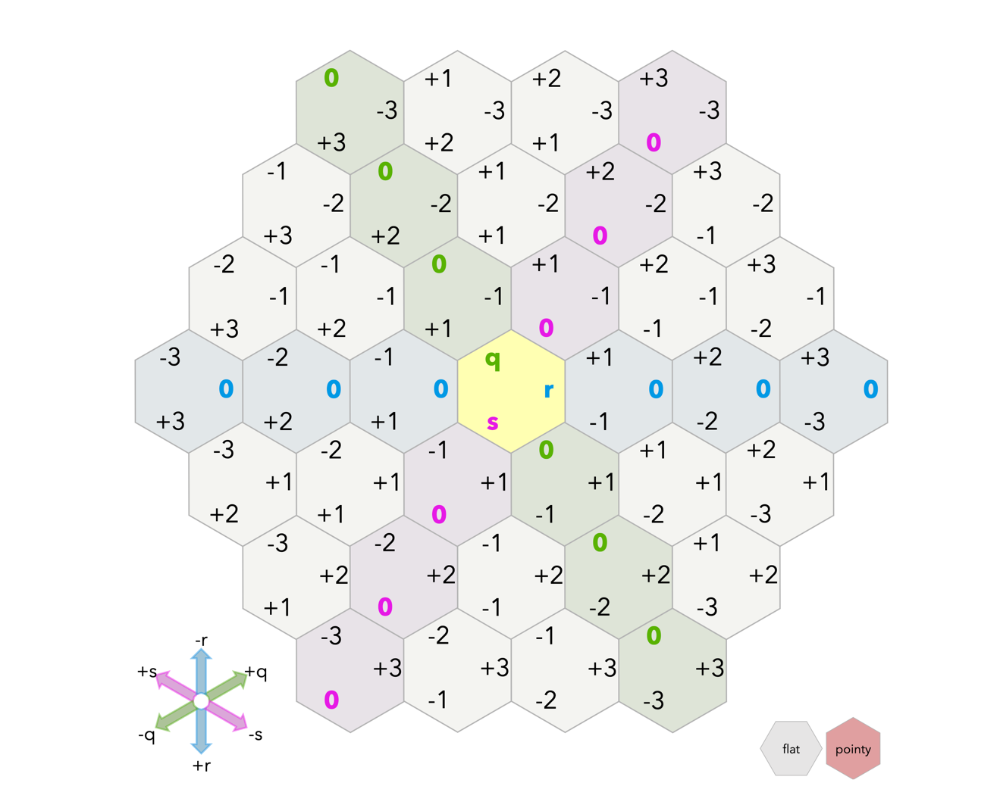

# Hexagonal Reversi Java Implementation

## Table of Major Contents
- [Overview](#overview)
- [Part 2](#part-2)
- [Part 3](#part-3)
- [Source Organization](#source-organization)
- [Part 4](#part-4)

## Overview

This Java codebase is an implementation of the classic Reversi game played on a hexagonal grid. It
follows the MVC (Model-View-Controller) architecture and offers a platform for playing Reversi in a
hexagonal variant. This README serves as a guide for understanding the purpose, structure, and
components of this codebase.


## Quick Start

To get started with this codebase and play a game of Hexagonal Reversi, follow these steps:

```java
import model.HexagonReversi;
import model.IReversiModel;
import mockplayerview.ReversiTextView;
import mockplayerview.TextView;

public class Main {
  public static void main(String[] args) {
    IReversiModel model = aHexagonReversi(6); // Specify the number of sides for the game board.
    TextView textView = aReversiTextView(model); // Provide the model for rendering.
    System.out.println(textView.toString()); // Display the game state in the console or your application.
  }
}
```

## Features

- Hexagonal board with
  the [cube coordinates system](https://www.redblobgames.com/grids/hexagons/#coordinates-cube)
- MVC architecture for a structured and modular design
- Player interactions, move validations, and piece capturing
- Customizable game rules and win conditions

## Class Invariant(s)

1. One of the recognized class invariants for the game was the fact that the sideLength of the board
   cannot be less than 3. This is due to the fact that a standard game of hexagon reversi cannot
   have less than 3 sides since there
   would be no valid move that can be played by either colored token.

2. Another invariant that is enforced in the code pertains to the
   [cube coordinates system](https://www.redblobgames.com/grids/hexagons/#coordinates-cube). An
   IllegalArgumentException is thrown if the sum of the coordinates that are passed into the
   constructor of the HexagonCell is not zero(**i.e. q+r+s != 0**).

3. The player passed into the `placePiece` method cannot be null since the model cannot place a null
   or empty
   player into a cell.

## Key Components

### Game Model

The `HexagonReversi` class is the core game model that implements the `IReversiModel` interface,
responsible for managing game mechanics, including player moves, turn passing, scoring, and game
state. It is built on top of the HexagonalBoard class,
representing the game board.

### Text-based View for Reversi

The `TextView` interface serves as a marker interface for text-based views in the Reversi game. The
`ReversiTextView` class implements this interface and provides a text-based representation of the
game
state. It uses the IReversiModel instance to render the game state in text format.

### Game Board Representation

IBoard Interface: Represents the game board and defines methods for cell ownership, move validation,
rendering, score retrieval, and listing valid moves.

### HexagonBoard Class:

An implementation of the IBoard interface, representing the hexagonal game board. It is initialized
with a specified side length. Key methods include newCellOwner, validMove, getCellOccupant,
toString, and validMovesLeft.

### Coordinate System



The [cube coordinates system](https://www.redblobgames.com/grids/hexagons/#coordinates-cube)
from [RedBlobGames](https://www.redblobgames.com/) was used to represent the location of each cell
in the Hexagonal grid for the game. One advantage of using this system
was that it was easy to check if a given cell was within the bounds of the grid and the fact that
the sum of the coordinates of the cell is always 0 made it easy to check if the coordinates are
valid
and within a hexagonal shape or not.

## Key Subcomponents

### Representing Players in the Game

#### IPlayer Interface:

`IPlayer` is a marker interface for player representation. It includes a method to retrieve the
player's tokenColor.
An IPlayer can be a human player or an AI(**not implemented yet**).
A concrete class for Human players, called HumanPlayer is made which represents Human Players. The
only field that the `HumanPlayer` class has is a `Color`.

#### HumanPlayer Class:

A concrete implementation of `IPlayer`, representing human players. It allows specifying the
player's
tokenColor upon instantiation, either `Color.BLACK` or `Color.WHITE`.

#### Color Enum:

The Color enum represents the two players, Black (B) and White (W). It simplifies player management
and provides a next() method for alternating turns.

### Representing Cells in the Board

#### ICell Interface:

An `ICell` represents the location of a cell in the game board grid. This interface was made with
the
intention of code extensibility so that the code can be extended to a new format of game board with
a game cell. The ICell interface has only one method, `getCoordinates()` which returns a list of
coordinates of the `ICell`.

#### HexagonCell Class:

The `HexagonCell` class implements the `ICell` interface and it represents the location of a cell in
a `HexagonBoard`. The class is configured to work with a game of `Hexagon Reversi`. The cell's
coordinates are based on the [cube coordinates system](#coordinate-system) mentioned above.
It has an invariant that limits the coordinates such that their sum is 0.


# Part 2

## Changes to the existing project for Part 2
- Removed a method called `placePiece(Color tokenColor, ICell cell)` from the model that
  gave excessive control on changing the game state irrespective of the current player,
  going against the rules of the game.
- Added a method called `placeCurrentPiece(ICell cell)` that places **only** the current player's
  piece in the cell if the move is valid. This limits the model's visibility and external control
  over the game state.
- Added a method called `getCellsFlipped(ICell cell)` that returns the number of cells that will
  be flipped if the current player places a piece in the given cell.
- Added a method called `getScore()` that returns the score of the current player.
- Made a read-only interface for the model so that the mockplayerview cannot make changes to the game state.

## Graphical View

The mockplayerview for this game is made in an interface called `ReversiView`. The interface is
further implemented in the concrete class `BasicReversiView` which extends the `JFrame` class to use
[Swing](https://docs.oracle.com/javase/tutorial/uiswing/components/index.html) components and
features. The mockplayerview works with
a [JPanel](https://docs.oracle.com/javase%2F7%2Fdocs%2Fapi%2F%2F/javax/swing/JPanel.html) class
called `ReversiPanel` which is responsible for rendering the game board on the mockplayerview(frame).

### ReversiPanel Class

The `ReversiPanel` class extends the `JPanel` class and renders the game board. Furthermore, it
handles mouse and keyboard inputs using `MouseEventListener` and `KeyAdapeter`
interfaces respectively.

### CartesianPosn

The `CartesianPosn` class represents a cartesian coordinate on the mockplayerview. The class is used to get
the cartesian coordinates of the center of the cells on the panel using its cube coordinates.
It has two fields, `x` and `y` which represent the x and y coordinates of the cartesian coordinate
in doubles.

### Mouse Inputs

The `ReversiPanel` class handles mouse inputs using the `MouseEventListener` interface. A cell on
the board is highlighted in <span style="tokenColor:cyan">**cyan**</span> when the mouse clicks it and
the same cell is deselected when one of four things happen:

- The mouse clicks on the same cell again.
- The mouse clicks on a different cell.
- The mouse clicks outside the board
- A key is pressed on the keyboard(*Note: nothing changes on the board in this case
  since a modelfeatures has not been made for the final version*).

The highlighted cell's coordinates in the
[cube coordinate system](https://www.redblobgames.com/grids/hexagons/#coordinates-cube)
are printed in the console when a cell is highlighted.

### Keyboard Inputs

The `ReversiPanel` class handles keyboard inputs using the `KeyAdapter` interface. The following
keys are used to control the game:

- `Space`: Places the current player's piece in the highlighted cell if the move is valid.
- `P` or `p`: Passes the turn to the next player.

## Changes for Part 2

- Removed a method called `placePiece(Color tokenColor, ICell cell)` from the model that
  gave excessive control on changing the game state irrespective of the current player,
  going against the rules of the game.
- Added a method called `placeCurrentPiece(ICell cell)` that places **only** the current player's
  piece in the cell if the move is valid. This limits the model's visibility and external control
  over the game state.
- Added a method called `getCellsFlipped(ICell cell)` that returns the number of cells that will
  be flipped if the current player places a piece in the given cell.
- Added a method called `getScore()` that returns the score of the current player.
- Made a read-only interface for the model so that the mockplayerview cannot make changes to the game state.

## Graphical View

The mockplayerview for this game is made in an interface called `ReversiView`. The interface is
further implemented in the concrete class `BasicReversiView` which extends the `JFrame` class to use
[Swing](https://docs.oracle.com/javase/tutorial/uiswing/components/index.html) components and
features. The mockplayerview works with
a [JPanel](https://docs.oracle.com/javase%2F7%2Fdocs%2Fapi%2F%2F/javax/swing/JPanel.html) class
called `ReversiPanel` which is responsible for rendering the game board on the mockplayerview(frame).

### ReversiPanel Class

The `ReversiPanel` class extends the `JPanel` class and renders the game board. Furthermore, it
handles mouse and keyboard inputs using `MouseEventListener` and `KeyAdapeter`
interfaces respectively.

### CartesianPosn

The `CartesianPosn` class represents a cartesian coordinate on the mockplayerview. The class is used to get
the cartesian coordinates of the center of the cells on the panel using its cube coordinates.
It has two fields, `x` and `y` which represent the x and y coordinates of the cartesian coordinate
in doubles.

### Mouse Inputs

The `ReversiPanel` class handles mouse inputs using the `MouseEventListener` interface. A cell on
the board is highlighted in <span style="tokenColor:cyan">**cyan**</span> when the mouse clicks it and
the same cell is deselected when one of four things happen:

- The mouse clicks on the same cell again.
- The mouse clicks on a different cell.
- The mouse clicks outside the board
- A key is pressed on the keyboard(*Note: nothing changes on the board in this case
  since a modelfeatures has not been made for the final version*).

The highlighted cell's coordinates in the
[cube coordinate system](https://www.redblobgames.com/grids/hexagons/#coordinates-cube)
are printed in the console when a cell is highlighted.

### Keyboard Inputs

The `ReversiPanel` class handles keyboard inputs using the `KeyAdapter` interface. The following
keys are used to control the game:

- `SPACE` or `ENTER`: Places the current player's piece in the highlighted cell if the move is valid.
- `P` or `p`: Passes the turn to the next player.

## Strategy

For this assignment, we implemented 6 different "strategies" which were essentially algorithms to
recommend moves within a game of a reversi, given a board state. The strategies were implemented
using the Strategy design pattern. The method shared by all strategies in the strategy interface
is called chooseMove. chooseMove takes in a read only model to ensure that strategies cannot change
the game state. chooseMove also takes in a list of ICell's which are "filtered moves" the reason
for this is so it is possible to give one strategy a list of moves to apply its logic to and then
returning a refined list. This approach allows the usage of multiple strategies "sandwiched"
together. The strategies are as follows:

### UpperLeftStrat

This strategy returns the uppermost and leftmost position that is valid or among the
list of moves passed into it.

### GreedyStrat

This strategy implements the greedy algorithm and aims to maximize the strategy player's gain in the
given move, i.e., it aims to conquer the most number of cells in the move. If two moves are deemed
to be equal, then this strategy returns the uppermost leftmost move amongst the equal moves using
the UpperLeftStrat.

## Extra Credit Strategies

### Sandwich

We implemented the class sandwich which is a strategy that aims to sandwich other strategies
together.

### AvoidEdges

This strategy aims to avoid the edges(cells adjacent to a corner cell) in the board.

### ChooseCorners

This Strategy aims to choose corners which give a positional advantage in the game because whoever
claims a corner will keep that corner.

### OurAlgorithm

This strategy uses a combination of other strategies. First, it considers every possible move, then
it considers the most logical opponent responses to that move as determined by the opponent using a
combination of strategies. The strategy searches for whichever move it can make, that will lead to
the opponents next best move being the lowest. It also ensures that if it can play a winning move,
that it will do so.

### MiniMaxStrategy
This strategy is inspired by the [minimax algorithm](https://en.wikipedia.org/wiki/Minimax) to
optimize the player's score gain against the opponent. Additionally, it avoids moves that will lead
the player to have a chance at winnning in the next move and aims to increase its score gain.
This strategy analyzes all the possible move combinations starting from the strategy player's moves
to the subsequent opponent's moves, assigning a weight to each possible move the strategy player
while doing so.


# Part 3
## Changes to the existing project for Part 3
There were some changes that were made to the project from part 2 in order to accomodate the
implementation of a controller and to accommodate communications between the model, view, and
controller. These changes include:
- The model contains a `startGame()` method that initializes the game and starts the game. This was
  done according to the requirements of the assignment with the intention of stopping the controller
  from performing any actions before the game has started.
- The model now contains a list of listeners(Controllers), one for each player in the game. This change
  was made so that the listener pattern could be implemented and so that the model could communicate with
  the multiple controllers in the game the color of the current player. To enable adding listeners to the model,
  the model now contains a method called `addListener(Controller controller)` which adds a controller to the
  list of controllers.
- All instances of a `Player` which are equivalent to the current `IPlayer` interface were removed from
  the model to completely get rid of the notion that a model needs to store the player information. Instead, the model
  now stores the color of the current player and keeps changing it after every move or pass. This was done since
  the controller is now responsible for storing the player information and the model only needs to know the color
  that plays next.
- The `ENTER` key was added as an alternative to the `SPACE` key for placing a piece in the highlighted cell.
- Bugs related to the logic of legal moves in edge cases in the model were fixed.

## New Classes with Part 3
### Controller
Controller is a class that facilitates communication between the model and the view. Through the
features interfaces that it uses, when certain events occur in the view, the controller can call
features that update the models game state and then this change is echoed from the model to the view
through another features interface. The controller has the required fields(model, color, view) and in addition to those, 
a modelFeatures and a playerFeatures field to enable communication between the model and the view. 

### IModelFeature interface and ModelFeatures Class
The IModelFeatures interface is a single-interface that is implemented by the concrete class ModelFeatures.
This interface contains all the methods that the model can call through the controller to notify the player
and views of the current color of the game.

### IPlayerFeature interface and PlayerFeatures interface
The IPlayerFeature interface is a single-interface implemented by the concrete class PlayerFeatures.
The interface contains all the methods that the player can call through the controller to notify the model
of the move that the player wants to play. The class implementation contains all the methods that 
the player and view can call through the controller. The player
calls these methods to play its move when the player is an AIPlayer(using the strategy)
and the view calls the method through the controller when the player is a HumanPlayer(using mouse and keyboard
inputs).

### HumanPlayer Class
The HumanPlayer class is a concrete implementation of the IPlayer interface. It represents a human player in the game and the methods
are just placeholder methods since the human player does not need to call any methods through the controller.

### AIPlayer Class
The AIPlayer class is a concrete implementation of the IPlayer interface. It represents an AI player in the game and the methods
have been implemented to call the methods through the controller to play the move that the AI wants to play according to the strategy it has.

### Commmand Line Configurator Commands
To play Reversi using the main method, use the command-line arguments to customize your game. Strategies include human 
(h), various AI strategies like Greedy (g), MiniMax (mm), and several Sandwich combinations 
(san1, san2, etc.). The game can be run yby running the jar file with the first argument as the strategy(`'h'` for human)
for the first player(Black token) and the second argument as the strategy(`'h'`) for the second player(White token).

    - `h`: Human Player
    - `g`: Greedy Strategy
    - `u`: Upper Left Strategy
    - `a`: Avoid Edges Strategy
    - `cc`: Choose Corners Strategy
    - `mm`: MiniMax Strategy
    - `oa`: Our Algorithm Strategy
    - `r` : Random Strategy
    - `san1`: Sandwich Strategy 1 comprising Greedy, Avoid Edges, and Choose Corners Strategies
    - `san2`: Sandwich Strategy 2 comprising Minimax and Greedy strategies.
    - `san3`: Sandwich Strategy 3 comprising Minimax, Greedy and Avoid Edges strategies.
    - `san4`: Sandwich Strategy 4 comprising Minimax, Greedy, Avoid Edges and Choose Corners
      strategies.

For example, to play a game of Reversi with a human player as the first player and a greedy strategy
as the second, run the following command in the project directory:
```bash
java -jar reversi.jar h g
```

# Part 4
## Changes Made for Part 4
- Some of the strategies(MiniMax and OurAlgorithm) were dependent on the concrete implementation of
the IReversiModel interface. This was changed to make the strategies use the IBoard interface methods
to quantify the moves and evaluate the best move(s).
- Apart from this one change, rest everything in our implementation of the 
reversi game was kept the same.
- The existing view showed an error dialog box when a player attempted to make a move when it isn't
    their turn.
- Apart from these changes, rest everything in our implementation of the
  reversi game was kept the same.

## Updated Command Line Configurator Commands
The first argument after calling reversi.jar is the strategy for the first player(using 
our implementation of strategies, and the view) and the second argument is the strategy for the second
player that uses the providers'(Troy Caron and Joshua Kung) strategy and view implementation. To accommodate the
new strategies and views, new classes and adapters were made to implement the adapter pattern. The following section
highlights these new classes and their functions. The new command line arguments are as follows:

**OurStrategies:**

        - `h`: Human Player
        - `g`: Greedy Strategy
        - `u`: Upper Left Strategy
        - `a`: Avoid Edges Strategy
        - `cc`: Choose Corners Strategy
        - `mm`: MiniMax Strategy
        - `oa`: Our Algorithm Strategy
        - `r` : Random Strategy
        - `san1`: Sandwich Strategy 1 comprising Greedy, Avoid Edges, and Choose Corners Strategies
        - `san2`: Sandwich Strategy 2 comprising Minimax and Greedy strategies.
        - `san3`: Sandwich Strategy 3 comprising Minimax, Greedy and Avoid Edges strategies.
        - `san4`: Sandwich Strategy 4 comprising Minimax, Greedy, Avoid Edges and Choose Corners
        strategies.

**Provider Strategies:**

        - `provider1`: Provider's Avoid Corner Neighbor Strategy
        - `provider2`: Provider's Random Move Strategy
        - `provider3`: Provider's Go For Corner Strategy
        - `provider4`: Provider's Check Corners First Strategy
        - `h`: Human Player

## New Classes with Part 4  
**Note that all the code pertaining to the provider's implementation, including the adapters are
present in the ```cs3500.provider``` package.**
### ControllerAdapter
The ```ControllerAdapter``` class is a concrete implementation of the ```ObserverInterface``` and 
```ControllerInterface``` interfaces. The main purpose of this class is to make the existing controller work with the
provider's Controller. One of the main features that distinguishes this class from the existing controller that we had
is the fact that our controller strictly acted as a bridge between the model and the view and all the connections(Model &rarr; Player and View and
Player and View &rarr; Model) that it made were distinguished into two interfaces, namely, ```IModelFeature``` and ```IPlayerFeature``` respectively.

### ModelAdapter
The ```ModelAdapter``` class is a concrete implementation of the ```ReversiModel``` and ```IModelFeature``` interfaces.
Since the ```ModelAdapter``` class was deemed to be a essential observer for our model, it was made to implement the
```IModelFeature``` interface. This way, the ```ModelAdapter``` class could be added to the list of observers in our model.
The main purpose of this class is to make the existing model work with the provider's model. 
All the player moves that are made on this model are emulated on our model as well and the observer methods 
of this class are adapted to work in order to translate the observations of our model to those of the provider's model.

### HumanPlayerAdapter and AIPlayerAdapter
The ```HumanPlayerAdapter``` and ```AIPlayerAdapter``` classes are concrete implementations of the ```IPlayer``` interface.
The main purpose of these classes is to make the provider's strategies work with the new model. A question pertaining to the design of
player functions was thought thoroughly and it was decided that the player functions should be implemented in the player adapter classes 
which implement the given player interface itself. This was done so that the player functions could be called directly from their classes instead
of having their strategies call them.


# Source Organization

```
├── README.md
├── images
│   ├── cubeCoordinatesSystem.jpg
│   ├── img.png
│   ├── img_1.png
│   └── img_2.png
├── out
│   ├── artifacts
│   │   └── reversi_jar
│   │       └── reversi.jar
│   ├── production
│   │   └── reversi
│   │       ├── META-INF
│   │       │   └── MANIFEST.MF
│   │       └── cs3500
│   │           └── reversi
│   │               ├── Reversi.class
│   │               ├── TestingReversiRunner.class
│   │               ├── controller
│   │               │   ├── Controller.class
│   │               │   ├── IModelFeature.class
│   │               │   ├── IPlayerFeature.class
│   │               │   ├── ModelFeatures.class
│   │               │   └── PlayerFeatures.class
│   │               ├── model
│   │               │   ├── HexagonBoard.class
│   │               │   ├── HexagonCell.class
│   │               │   ├── HexagonReversi.class
│   │               │   ├── IBoard.class
│   │               │   ├── ICell.class
│   │               │   ├── IReversiModel.class
│   │               │   ├── ROHexagonModel.class
│   │               │   ├── ROModel.class
│   │               │   └── TokenColor.class
│   │               ├── player
│   │               │   ├── AIPlayer.class
│   │               │   ├── HumanPlayer.class
│   │               │   └── IPlayer.class
│   │               ├── strategy
│   │               │   ├── AvoidEdgesStrat.class
│   │               │   ├── ChooseCornersStrat.class
│   │               │   ├── GreedyStrat.class
│   │               │   ├── MiniMaxStrategy.class
│   │               │   ├── OurAlgorithmStrat.class
│   │               │   ├── RandomStrat.class
│   │               │   ├── SandwichStrat.class
│   │               │   ├── Strategy.class
│   │               │   ├── UpperLeftStrat$UpperLeftComparator.class
│   │               │   └── UpperLeftStrat.class
│   │               └── view
│   │                   ├── BasicReversiView.class
│   │                   ├── CartesianPosn.class
│   │                   ├── CoordUtilities.class
│   │                   ├── ReversiPanel$KeyboardEventListener.class
│   │                   ├── ReversiPanel$MouseEventListener.class
│   │                   ├── ReversiPanel.class
│   │                   ├── ReversiTextView.class
│   │                   ├── ReversiView.class
│   │                   └── TextView.class
│   └── test
│       └── reversi
│           ├── controller
│           │   └── ExampleControllerTests.class
│           ├── mockmodel
│           │   ├── ExampleMockModelTests.class
│           │   └── MockModel.class
│           ├── mockplayerview
│           │   ├── ExampleMockPlayerViewTests.class
│           │   ├── MockPlayer.class
│           │   └── MockView.class
│           ├── mockstrategy
│           │   ├── ExampleMockStrategyTests$MockStrategy.class
│           │   └── ExampleMockStrategyTests.class
│           ├── model
│           │   ├── ExampleATests.class
│           │   ├── ExampleAuxillaryTests.class
│           │   ├── ExampleBoardTests.class
│           │   ├── ExampleModelTests.class
│           │   └── MockModel.class
│           ├── player
│           │   ├── ExampleMockPlayerTests.class
│           │   └── MockPlayer.class
│           └── strategy
│               ├── AvoidEdgesTests.class
│               ├── ChooseCornersTests.class
│               ├── GreedyStrategyTests.class
│               ├── MinimaxTests.class
│               └── UpperLeftStrategyTests.class
├── reversi.iml
├── reversi.jar
├── src
│   ├── META-INF
│   │   └── MANIFEST.MF
│   └── cs3500
│       └── reversi
│           ├── Reversi.java
│           ├── TestingReversiRunner.java
│           ├── controller
│           │   ├── Controller.java
│           │   ├── IModelFeature.java
│           │   ├── IPlayerFeature.java
│           │   ├── ModelFeatures.java
│           │   └── PlayerFeatures.java
│           ├── model
│           │   ├── HexagonBoard.java
│           │   ├── HexagonCell.java
│           │   ├── HexagonReversi.java
│           │   ├── IBoard.java
│           │   ├── ICell.java
│           │   ├── IReversiModel.java
│           │   ├── ROHexagonModel.java
│           │   ├── ROModel.java
│           │   └── TokenColor.java
│           ├── player
│           │   ├── AIPlayer.java
│           │   ├── HumanPlayer.java
│           │   └── IPlayer.java
│           ├── strategy
│           │   ├── AvoidEdgesStrat.java
│           │   ├── ChooseCornersStrat.java
│           │   ├── GreedyStrat.java
│           │   ├── MiniMaxStrategy.java
│           │   ├── OurAlgorithmStrat.java
│           │   ├── RandomStrat.java
│           │   ├── SandwichStrat.java
│           │   ├── Strategy.java
│           │   └── UpperLeftStrat.java
│           └── view
│               ├── BasicReversiView.java
│               ├── CartesianPosn.java
│               ├── CoordUtilities.java
│               ├── ReversiPanel.java
│               ├── ReversiTextView.java
│               ├── ReversiView.java
│               └── TextView.java
├── strategy-transcript.txt
└── test
    ├── controller
    │   └── ExampleControllerTests.java
    ├── mockmodel
    │   ├── ExampleMockModelTests.java
    │   └── MockModel.java
    ├── mockplayerview
    │   ├── ExampleMockPlayerViewTests.java
    │   ├── MockPlayer.java
    │   └── MockView.java
    ├── mockstrategy
    │   └── ExampleMockStrategyTests.java
    ├── model
    │   ├── ExampleATests.java
    │   ├── ExampleAuxillaryTests.java
    │   ├── ExampleBoardTests.java
    │   ├── ExampleModelTests.java
    │   └── MockModel.java
    ├── player
    │   ├── ExampleMockPlayerTests.java
    │   └── MockPlayer.java
    └── strategy
        ├── AvoidEdgesTests.java
        ├── ChooseCornersTests.java
        ├── GreedyStrategyTests.java
        ├── MinimaxTests.java
        └── UpperLeftStrategyTests.java
```